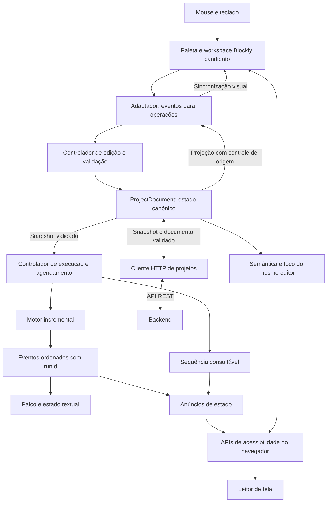

# Componentes do frontend

```mermaid
flowchart TD
  input["Mouse e teclado"] --> editor["Paleta e workspace Blockly candidato"]
  editor --> adapter["Adaptador: eventos para operações"]
  adapter --> commands["Controlador de edição e validação"]
  commands --> state["ProjectDocument: estado canônico"]
  state -->|"Projeção com controle de origem"| adapter
  adapter -->|"Sincronização visual"| editor
  state --> semantic["Semântica e foco do mesmo editor"]
  semantic --> editor
  state -->|"Snapshot validado"| runner["Controlador de execução e agendamento"]
  runner --> engine["Motor incremental"]
  engine --> events["Eventos ordenados com runId"]
  events --> stage["Palco e estado textual"]
  runner --> sequence["Sequência consultável"]
  events --> announcements["Anúncios de estado"]
  sequence --> announcements
  announcements --> browser["APIs de acessibilidade do navegador"]
  semantic --> browser
  browser --> reader["Leitor de tela"]
  state <-->|"Snapshot e documento validado"| client["Cliente HTTP de projetos"]
  client <-->|"API REST"| api["Backend"]
```

Semântica e foco são responsabilidades internas do editor único, não uma interface alternativa. Palco e anúncios consomem eventos da mesma execução.
