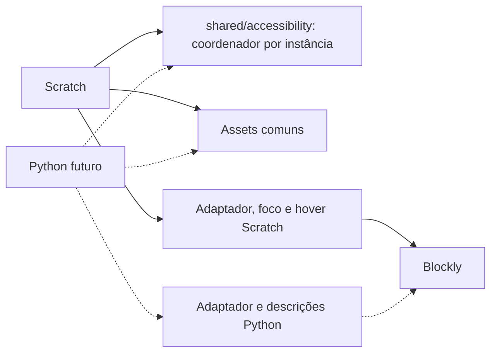

# Componentes compartilhados

```mermaid
flowchart LR
  Scratch["Scratch"] --> Announcements["shared/accessibility: coordenador por instância"]
  Scratch --> Assets["Assets comuns"]
  Python["Python futuro"] -.-> Announcements
  Python -.-> Assets
  Scratch --> Adapter["Adaptador, foco e hover Scratch"]
  Python -.-> PythonAdapter["Adaptador e descrições Python"]
  Adapter --> Blockly["Blockly"]
  PythonAdapter -.-> Blockly
```

Paleta, layout e workspace genéricos não foram extraídos sem um segundo consumidor. Descrições e regras de linguagem permanecem nos módulos.
