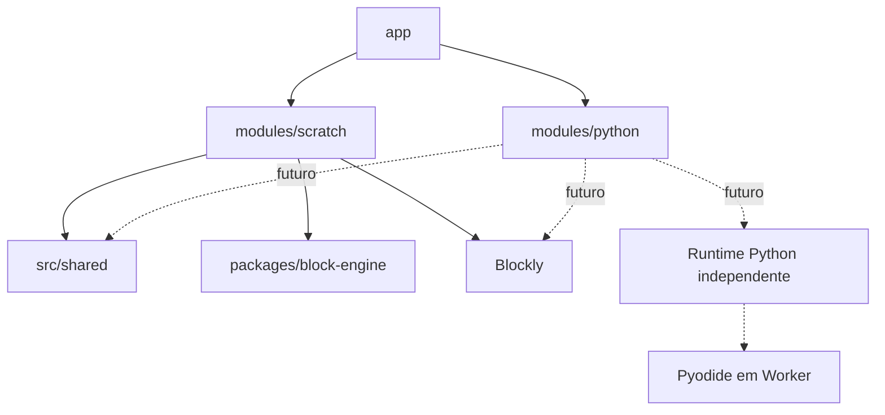

# Direção das dependências

```mermaid
flowchart TD
  App["app"] --> Scratch["modules/scratch"]
  App --> Python["modules/python"]
  Scratch --> Shared["src/shared"]
  Python -. "futuro" .-> Shared
  Scratch --> Engine["packages/block-engine"]
  Scratch --> Blockly["Blockly"]
  Python -. "futuro" .-> Blockly
  Python -. "futuro" .-> Runtime["Runtime Python independente"]
  Runtime -.-> Pyodide["Pyodide em Worker"]
```

Não há dependência Scratch ↔ Python. `shared` não importa módulos. O runtime Python não importa o motor Scratch.
