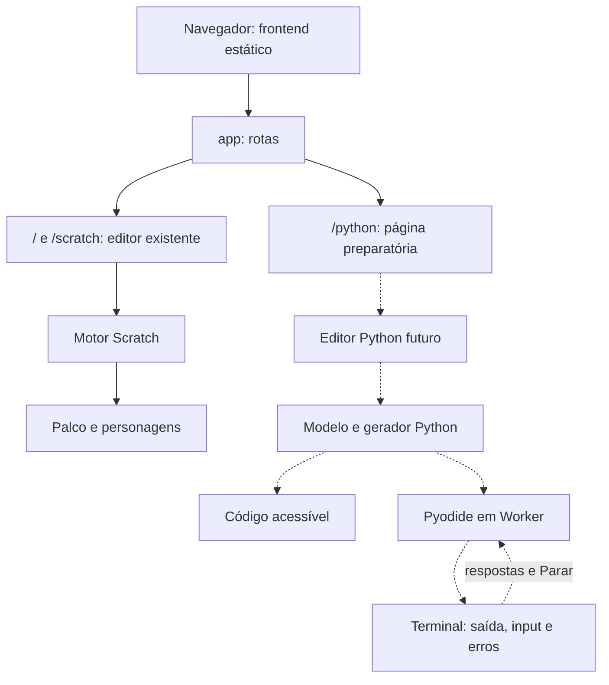

# Arquitetura geral dos módulos

Linhas tracejadas representam componentes futuros. Fase B implementa Scratch encapsulado e página Python preparatória.

```mermaid
flowchart TD
  Browser["Navegador: frontend estático"] --> Routes["app: rotas"]
  Routes --> Scratch["/ e /scratch: editor existente"]
  Routes --> Python["/python: página preparatória"]
  Scratch --> Engine["Motor Scratch"]
  Engine --> Stage["Palco e personagens"]
  Python -.-> Blocks["Editor Python futuro"]
  Blocks -.-> Generator["Modelo e gerador Python"]
  Generator -.-> Code["Código acessível"]
  Generator -.-> Worker["Pyodide em Worker"]
  Worker -.-> Terminal["Terminal: saída, input e erros"]
  Terminal -. "respostas e Parar" .-> Worker
```
