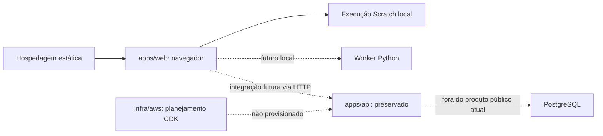

# Frontend, backend e infraestrutura

```mermaid
flowchart LR
  Host["Hospedagem estática"] --> Web["apps/web: navegador"]
  Web --> Scratch["Execução Scratch local"]
  Web -. "futuro local" .-> Python["Worker Python"]
  Web -. "integração futura via HTTP" .-> API["apps/api: preservado"]
  API -. "fora do produto público atual" .-> DB["PostgreSQL"]
  IaC["infra/aws: planejamento CDK"] -. "não provisionado" .-> API
```

Não há endpoint de execução Python. Backend e AWS não são dependências dos módulos no MVP; não há contas ou persistência pública nesta fase.
